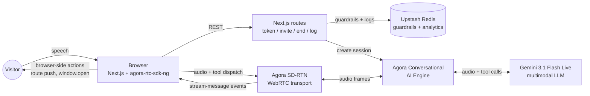

# Agora + Gemini Live Voice Agent — Skill

A reusable methodology for shipping voice-chat AI agents on the web,
distilled from a production deployment at [alexlee.space](https://alexlee.space).

This is **methodology, not a runtime library**. There's no npm
package. What's inside is the architectural decisions, wire-format
gotchas, prompt rules, and the production failure modes that only
show up after real users use the thing. If you're about to build a
voice agent — on this stack or any adjacent one — these notes exist
so you don't have to learn what I learned.

Sixteen hours of work, forty-six QA regression cases, eleven
production failure modes documented. Open-sourced because the
debugging arc is what you don't want to live through twice.

---

## What this saves you

Concrete time estimates, based on what each problem cost the first
time:

| Problem | Time you'd otherwise spend | What this skill gives you |
|---|---|---|
| Picking the right architecture (pipeline vs multimodal Live) | 2-4 hours of deliberation | Decision framework with explicit tradeoffs in `SKILL.md` Step 1 |
| Reverse-engineering Agora's chunked data-channel wire format | 3-5 hours staring at runtime logs | Parser code in `references/decoding.md` |
| Discovering the schema-casing gotcha (uppercase types crash with `code 500`) | 30-60 min trial and error | One row in the pitfalls table |
| Realizing preview multimodal LLMs narrate tool calls without emitting them | 2 hours minimum (you'll think it's your code) | Six-layer transcript-fallback in `references/transcript-fallback.md` |
| Building cost guardrails after the first abuse scare | 4-6 hours including the negative-budget bypass bug | Three-layer Upstash gates in `references/guardrails.md` |
| Diagnosing "it didn't work" reports from real users | Hours of guessing per report | Diagnostic CLI in `references/analytics.md` — 30-second answers |
| Tuning the system prompt to stop the agent from teleporting visitors | 1-2 hours iterating | Ten hard prompt rules in `references/prompt-rules.md` |
| Choosing how to ground the agent in your KB (full inject vs topic-routed vs RAG) | 4-8 hours of evaluation + premature complexity | Three strategies with cadence guidance in `references/kb-grounding.md` |

**~15-25 hours of debugging distilled into ~30 minutes of reading +
targeted copy-paste.** The skill won't write the code for you. It'll
keep you from re-paying the cost of every gotcha.

---

## What this is NOT

- ❌ A runtime library — you copy patterns from the references into
  your own codebase
- ❌ Stack-prescriptive — Agora + Gemini Live is the worked example;
  most lessons (transcript-fallback, cost guardrails, analytics,
  prompt rules) generalize to other multimodal LLMs and transports
- ❌ A guarantee — preview models change, vendors change, your
  requirements change. Use this as a head start, not a finish line

---

## What's inside

```
SKILL.md                          # Entry point — read this first
references/
  ├── env-vars.md                 # Full env var template + sourcing
  ├── route-templates.md          # Drop-in Next.js route handlers
  ├── tool-definitions.md         # Gemini Live tool function format
  ├── guardrails.md               # 3-layer Upstash cost controls
  ├── decoding.md                 # Agora wire format parser
  ├── transcript-fallback.md      # 6-layer matcher pattern
  ├── voice-catalog.md            # 30 Gemini voices with descriptors
  ├── client-component.md         # React state machine + RTC lifecycle
  ├── analytics.md                # Private session logging + diagnostic CLI
  ├── prompt-rules.md             # 10 hard prompt rules
  └── kb-grounding.md             # 3 KB strategies (full inject, topic-routed, RAG) + support patterns
```

---

## When to use this

The worked example is a personal portfolio. The methodology applies
to any **voice-chat agent on a website that takes browser-side
actions**. Use cases:

- 🎯 **Customer support** — voice channel for the long-tail tier-1
  questions a chat widget already handles. Ground in your support
  KB, walk visitors through troubleshooting, escalate to a human (or
  open a ticket) when uncertain. See `references/kb-grounding.md`.
- 🎯 **Product support / in-product help** — drop a mic in the
  corner of a SaaS. Visitor asks "how do I export a CSV?"; agent
  describes the flow and navigates them there. The agent can do
  things on the user's screen, not just describe them.
- 🎯 **Internal help desks (IT, HR, ops)** — ground in internal
  docs and runbooks. Employee says "I can't access Tableau"; agent
  walks them through the standard fix, opens a ticket if those
  don't work. Cost guardrails matter MORE here.
- 🎯 **Sales qualification + demo guides** — visitor describes
  their company; agent describes relevant features, opens matching
  pages, offers to book a demo. The hybrid voice + booking pattern
  in this skill is exactly this flow.
- 🎯 **Portfolios / personal sites** — the original use case.

**Use the full skill if you're on:** Next.js + Vercel + Agora
Conversational AI Engine + Gemini Live + Upstash Redis.

**Use parts of the skill if you're on:** ElevenLabs Conversational
AI / OpenAI Realtime / Deepgram pipeline / LiveKit. Most patterns
transfer:

- Six-layer transcript-pattern fallback
- Three-layer Upstash cost guardrails
- Analytics shape + diagnostic CLI
- KB-grounding strategies (full inject / topic-routed / RAG)
- Ten prompt rules

**Skip this skill if:**

- You want **text chat** — use Vercel AI SDK or similar
- You want **transcription only** (no agent) — use Deepgram or
  AssemblyAI directly
- You're building **agent-to-agent** orchestration — different
  problem space

---

## The architecture at a glance



Browser ↔ Agora SD-RTN ↔ Agora Conversational AI Engine ↔ Gemini
Live. Agora handles WebRTC transport. Gemini Live is the multimodal
LLM — audio in, reasoning, audio out, tool calls. The browser
subscribes to the agent's audio stream and listens for tool-call
events on a data channel. Server-side: Next.js route handlers issue
tokens, invite the agent into the channel, enforce cost guardrails.

No separate STT or TTS — the model handles audio end-to-end.

---

## The hard-won lessons in one screen

The production failure modes that cost real time. Read SKILL.md for
the full list with diagnostics and fixes.

| Symptom | Root cause | Fix |
|---|---|---|
| Agent narrates `"opening it"` but page doesn't change | Anaphora — pronoun referring to prior turn | Track last-mentioned target across turns; pass as context to dispatcher |
| Agent narrates `"Opened the calendar now"` (past tense) and nothing fires | Verb regex misses past tense | Expand verb set across all tense forms |
| Tool fires for the wrong action when agent mentions both in one turn | Dispatcher searches whole text | Slice at first offer phrase; only search commitment portion |
| Agent narrates without emitting `function_call` | Preview-tier multimodal model unreliability | Build transcript-pattern fallback alongside real function calls |
| `voice:sessions:index` ZSET stays empty | `zremrangebyrank(0, -1001)` deletes only member when N≤1000 | Gate trim on `ZCARD > 1000` |
| Agent confidently narrates success when tool returned `ok: false` | Model can't be trusted to surface failures | Client-side toast surfaces real tool result |
| Agent collects name/email by voice and mishears them | Voice is bad at high-precision data entry | Hybrid: voice for warmup + offer, calendar form for data |

---

## Quick start

1. Read **SKILL.md** top to bottom. ~15 minutes. The pitfalls table
   at the end saves you the most time.
2. Read `references/transcript-fallback.md` carefully — the matcher
   is the load-bearing piece.
3. Read `references/analytics.md` before you ship. Build private
   logging on day one, not day two.
4. Pull from `references/route-templates.md` and
   `references/client-component.md` for the actual code skeleton.

---

## Stack assumptions

- Next.js (App Router) on Vercel
- React 19+
- TypeScript
- `agora-agent-server-sdk@^1.3.2` (server-side)
- `agora-rtc-sdk-ng@^4.24.3` + `agora-rtm@^2.2.x` (client-side)
- `@upstash/redis` + `@upstash/ratelimit` for guardrails + analytics
- Gemini API (model: `gemini-3.1-flash-live-preview` as of May 2026 —
  verify the latest at
  [ai.google.dev/gemini-api/docs/models](https://ai.google.dev/gemini-api/docs/models))

If you're on a different framework or transport, the methodology
still applies; the route templates won't.

---

## Cost profile

Per-minute cost lands at ~$0.15–0.30 (Agora ~$0.001/min + Gemini
Live ~$0.10–0.20/min depending on input/output ratio). For a
personal portfolio with the default guardrails (single-session
lock + 3 sessions/IP/day + $5/day kill switch), realistic max-abuse
cost is ~$2.70/IP/day. Daily kill switch caps total exposure at $5.

---

## Open questions / known gaps

- **GA Gemini Live should retire most of the transcript fallback.**
  When function-calling reliability climbs at the model layer, the
  six-layer matcher becomes overkill. Keep it as a thin safety net.
- **Mobile / iOS Safari** has stricter audio autoplay policies — the
  current pattern works but the start-call flow needs a UX tweak for
  reliability on iOS. Untested at the time of writing.
- **Small-LLM intent classifier** (e.g. Gemini Flash called per turn
  to dispatch into a small action vocabulary) would replace the
  regex matcher and handle anaphora natively. Trade-off: latency +
  cost vs. flexibility. Worth re-evaluating with production data
  after a few weeks.

---

## Provenance

Built and battle-tested at [alexlee.space](https://alexlee.space)
over two evenings in May 2026. Started after watching Mason from
Agora demo a voice agent on Gemini Live 3.1 in [this Google
Developers YouTube video](https://www.youtube.com/watch?v=2ltcbA2CCTo)
— the demo got me started; the production failure modes got
documented as I encountered them on my own surface.

Sixteen hours total. Forty-six QA regression cases — each one a
verbatim production transcript that broke an earlier version.
Eleven distinct production failure modes documented.

Case study with the architecture decisions and tradeoffs:
[alexlee.space/case-studies/voice-agent](https://alexlee.space/case-studies/voice-agent).

---

## License

MIT. Use it, fork it, improve it. If you ship a voice agent based
on this skill and learn something I missed, file an issue or send a
PR — the methodology compounds when more people contribute their
production failure modes.

---

## Author

Alex Lee — building AI products in public.

- Portfolio: [alexlee.space](https://alexlee.space)
- LinkedIn: [linkedin.com/in/chef-](https://www.linkedin.com/in/chef-)

If you found this useful, the easiest way to say thanks is to share
the case study with one other person who's about to build something
similar.

---

*Author's note: this skill was drafted with Claude (Anthropic),
edited by Alex. The voice agent, the bugs, and the methodology are
all real.*
