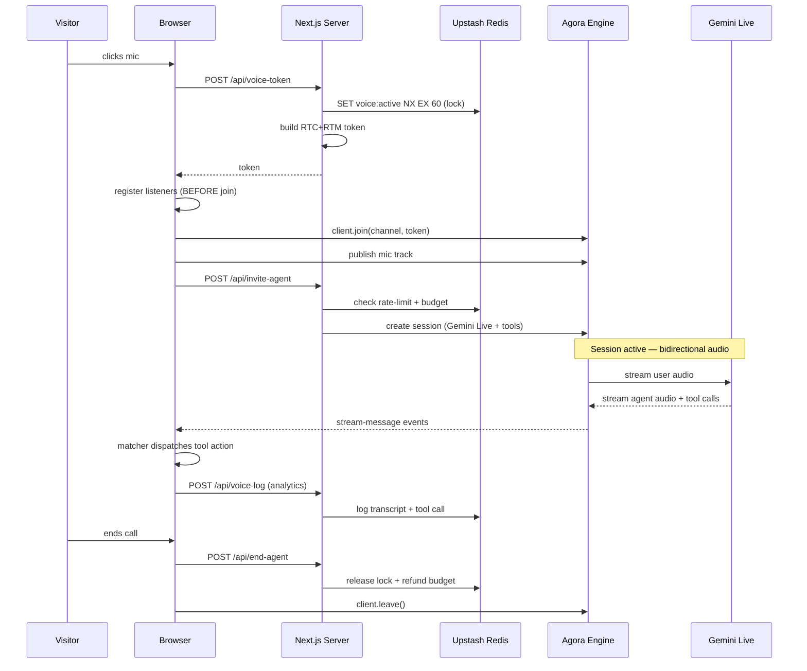

# Client Component — Voice Agent UI + State Machine

The browser-side component. One file, `'use client'`, owns the full call lifecycle. Glass aesthetic with cyan/pink accents (Aetheris-style) but the structure is reusable for any visual language.

## State machine

```
idle ─click─▶ connecting ─session.start─▶ active ─[end]─▶ ending ─teardown─▶ idle
                                            │
                                            └─[error]─▶ error ─acknowledge─▶ idle
```

## Lifecycle

### Sequence overview



The most-easily-broken step in this sequence is **listener
registration before `client.join()`**. Late binding misses early
messages, including the first tool call. Keep listeners attached
synchronously in the same code path that builds the client.

### Click-to-start (`startCall`)

1. POST `/api/voice-token` → get RTC+RTM token
2. Lazy-import `agora-rtc-sdk-ng` (~800KB — keep out of main bundle)
3. Create RTC client, register ALL listeners (BEFORE join):
   - `user-joined` — log who entered the channel
   - `user-published` — subscribe to remote audio + play it
   - `stream-message` — decode wire format, route tool calls
4. `client.join(appId, channel, token, uid)`
5. Get mic via `AgoraRTC.createMicrophoneAudioTrack()`
6. `client.publish(mic)`
7. POST `/api/invite-agent` to bring the agent into the channel
8. Start session timer (auto-disconnect on `MAX_SESSION_SECONDS`)
9. Transition to `active`

### Click-to-end (`endCall`)

1. Stop session timer
2. Clear fallback-fired ref (transcript dedup state)
3. Close mic track
4. `client.leave()`
5. POST `/api/end-agent` — releases server-side lock + refunds budget. **Await this before next session start** so subsequent calls don't hit BUSY.
6. Transition to `idle`

### Looping connect chime (UX polish)

Procedural Web Audio API chime that plays during `connecting` state. Two-note pattern (C5 → G5, perfect fifth, sine wave with soft envelope) on 1.8s loop. No audio file needed.

```ts
useEffect(() => {
  if (status !== 'connecting') return;
  const AudioCtx = window.AudioContext;
  if (!AudioCtx) return;
  const ctx = new AudioCtx();
  let stopped = false;

  const playChime = () => {
    if (stopped || ctx.state === 'closed') return;
    const now = ctx.currentTime;
    const peak = 0.06;

    // C5
    const osc1 = ctx.createOscillator();
    const gain1 = ctx.createGain();
    osc1.type = 'sine';
    osc1.frequency.value = 523.25;
    gain1.gain.setValueAtTime(0, now);
    gain1.gain.linearRampToValueAtTime(peak, now + 0.05);
    gain1.gain.exponentialRampToValueAtTime(0.0001, now + 0.85);
    osc1.connect(gain1).connect(ctx.destination);
    osc1.start(now);
    osc1.stop(now + 0.9);

    // G5 (delayed by 280ms)
    const osc2 = ctx.createOscillator();
    const gain2 = ctx.createGain();
    osc2.type = 'sine';
    osc2.frequency.value = 783.99;
    gain2.gain.setValueAtTime(0, now + 0.28);
    gain2.gain.linearRampToValueAtTime(peak, now + 0.33);
    gain2.gain.exponentialRampToValueAtTime(0.0001, now + 1.15);
    osc2.connect(gain2).connect(ctx.destination);
    osc2.start(now + 0.28);
    osc2.stop(now + 1.2);
  };

  playChime();
  const interval = setInterval(playChime, 1800);

  return () => {
    stopped = true;
    clearInterval(interval);
    setTimeout(() => {
      if (ctx.state !== 'closed') void ctx.close();
    }, 1500);
  };
}, [status]);
```

## Mounting

The component lives at the root layout level so it's available on every page:

```tsx
// src/app/layout.tsx
import { VoiceAgent } from '@/components/voice-agent/VoiceAgent';

export default function RootLayout({ children }) {
  return (
    <html>
      <body>
        {children}
        <VoiceAgent />
      </body>
    </html>
  );
}
```

## UX patterns that worked

- **Floating button bottom-right** — always visible, doesn't crowd content
- **Click chat icon → opens settings panel (voice picker) → user clicks "Initiate Call"** — gives users control over voice choice without forcing it
- **Ambient pink glow on idle button, cyan on active** — cyan = engaged, pink = standby
- **Mid-call voice swap** — chip in active panel opens picker, "Switch & Restart" ends current and starts new with new voice
- **Cap at 3 minutes** — prevents runaway sessions, costs bounded
- **Hint text "Say 'hello' or ask about X"** — sets expectations since 3.x Live waits for user speech first
- **"Speak any language" prompt rule** — Gemini Live is multilingual; tell users + tell the model

## TypeScript types

```ts
// src/types/voice.ts
export interface ClientStartRequest {
  requester_id: string;
  channel_name: string;
  voice?: string;
}

export interface AgentStartResponse {
  agent_id: string;
  create_ts: number;
  state: 'RUNNING';
}

export interface AgentErrorResponse {
  error: string;
  code?: 'BUSY' | 'RATE_LIMITED' | 'BUDGET_EXCEEDED' | 'CONFIG_ERROR' | 'AGORA_ERROR';
}

export type AgentToolCall =
  | { name: 'open_project'; arguments: { slug: string } }
  | { name: 'open_project_new_tab'; arguments: { slug: string } }
  | { name: 'open_live_demo'; arguments: { slug: string } }
  | { name: 'open_external_link'; arguments: Record<string, never> };
```

## Mobile considerations

- The "Chat with AI" pill next to the floating button is hidden below `sm:` breakpoint to avoid crowding small screens
- The floating button itself stays visible on all sizes
- Active call panel constrains to 22rem width, fits comfortably on mobile
- Test on iOS Safari specifically — has stricter audio autoplay policies than Chrome
- The mic permission prompt fires on click; works fine on iOS as long as it's user-initiated

## Reference implementation

The patterns above are extracted from a working voice-agent component
of ~700 lines that runs in production at
[alexlee.space](https://alexlee.space). All the patterns described
here (state machine, lazy SDK import, listener-before-join order,
mic publish/unpublish, teardown ref discipline) compose into that
component.

Click the mic in the bottom-right corner of the live site to see the
component behavior. The patterns work; they just need to be assembled
into your codebase to your shape.
