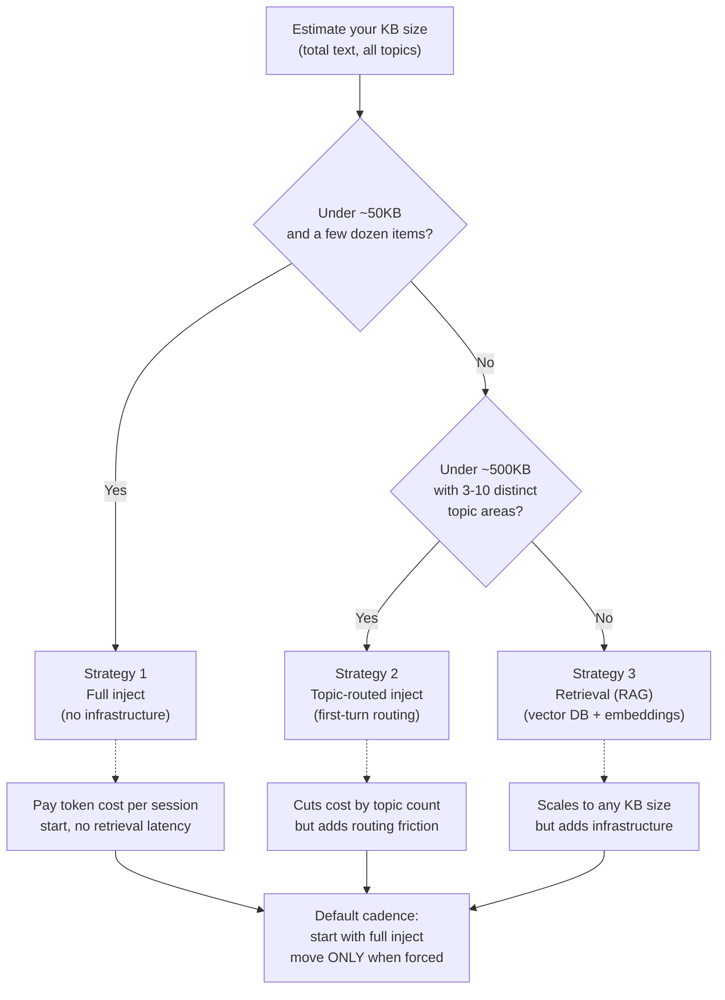

# Grounding the Agent in Your Own Knowledge Base

The skill's transport, matcher, and prompt rules are vendor- and
domain-agnostic. The thing that makes the agent *useful* for your
specific use case — portfolio, customer support, product help,
internal desk, sales — is the **KB you ground it in**. This doc
covers the three grounding strategies, when to use each, and the
specific patterns I recommend for support-style use cases.

The portfolio (the worked example for this skill) uses the simplest
possible strategy: full inject of two files (`bio.md` + structured
`projects.ts` data) into the system prompt at session start. That
works at portfolio scale. It breaks at customer-support scale. This
doc explains the spectrum.

---

## Pick a strategy



Most teams overshoot. RAG looks like the "real engineering" answer
and gets reached for prematurely. The portfolio runs on full inject
and will probably hold until the project count hits ~50.

For customer support specifically: **start with full inject of your
top 20 FAQ articles plus product taglines.** That covers ~80% of
tier-1 inbound. Add retrieval when the long tail actually starts
mattering more than the head — which is later than most teams think.

---

## Strategy 1 — Full inject (small KB)

**When:** Your KB fits in ~50KB of text. No more than a few dozen
"things" the agent should know about (projects, features, FAQs,
product pages).

**How:** Read your KB at server start (or per-session start), build a
single string, append it to the system prompt, hand to the LLM.

```ts
// promptBuilder.ts (simplified)
import { readFileSync } from 'node:fs';
import { join } from 'node:path';

const PERSONA_RULES = `
You are an AI agent for AcmeCorp. You answer questions about Acme's
products. You speak in the third person about the company.

# Honesty
- If asked something not in your KB, say "I'd have to check on that."
- NEVER invent product names, prices, dates, or capabilities.

# Tools
- open_product(slug)  — navigate to a product page
- open_pricing()      — open the pricing page
- open_demo_booking() — open the calendar to book a demo
- escalate()          — flag this conversation for a human

# Style
- Voice conversation: 1-2 sentences per reply.
- Never enumerate. No bullet points.
- Match the user's language.
`;

export function buildSystemPrompt(): string {
  const productsBlock = readFileSync(
    join(process.cwd(), 'kb/products.md'),
    'utf-8',
  );
  const faqsBlock = readFileSync(
    join(process.cwd(), 'kb/faqs.md'),
    'utf-8',
  );

  return `${PERSONA_RULES.trim()}

# Products

${productsBlock.trim()}

# FAQs

${faqsBlock.trim()}
`.trim();
}
```

**Pros:** Zero infrastructure. No vector DB, no embedding service, no
retrieval round-trip. The model has the full KB in context every turn.

**Cons:** Token cost scales with KB size × number of sessions. Above
~50KB the cost-per-session stops being negligible.

**Cadence I recommend:** start here. Move only when forced.

---

## Strategy 2 — Topic-routed inject (medium KB)

**When:** Your KB has 3-10 distinct topic areas, each with its own
~30-50KB of content. Examples: a SaaS with separate Reporting / Billing
/ Integrations / Admin areas. A support KB with separate Account /
Hardware / Software / Billing categories.

**How:** First turn of the conversation asks "what are you trying to
do?" The agent routes to a topic-specific system prompt that contains
only the matching topic's KB. If the user switches topics mid-session,
the server re-builds the system prompt for the new topic.

```ts
type Topic = 'billing' | 'integrations' | 'admin' | 'reporting';

export function buildTopicPrompt(topic: Topic | null): string {
  const base = PERSONA_RULES.trim();
  if (!topic) {
    // First turn — route the user to a topic.
    return `${base}

# First turn

Your VERY FIRST response: warm welcome plus this question:
"What can I help you with — billing, integrations, admin, or reporting?"
Wait for their answer; do NOT describe features yet.`;
  }
  const topicBlock = readFileSync(
    join(process.cwd(), 'kb/topics', `${topic}.md`),
    'utf-8',
  );
  return `${base}

# Active topic: ${topic}

${topicBlock.trim()}`;
}
```

**Pros:** Cuts token cost roughly proportional to (number of topics).
The agent only pays for the topic the user actually cares about.

**Cons:** First-turn routing adds friction. The user has to declare
intent before they can ask anything. Mid-session topic switches need
state tracking.

**Cadence I recommend:** when a single full-inject prompt exceeds
~75KB or you're paying real money per session. Below that, full
inject is simpler.

---

## Strategy 3 — Retrieval-augmented generation (large KB)

**When:** Your KB is above ~500KB. Full product documentation,
multi-year ticket history, regulatory content, anything where
"what's relevant?" itself is the hard question.

**How:** Embed your KB chunks once (overnight job). Store in a vector
DB. Add a `search_kb(query, k)` tool to the agent's toolkit. The
agent calls it when it needs context, gets back the top K chunks,
incorporates them into the response.

```ts
// Tool definition exposed to the agent
{
  name: 'search_kb',
  description:
    "Search Acme's knowledge base for relevant articles. Use this whenever the user asks a specific factual question about products, pricing, support steps, or policy. Returns the top 3 article snippets.",
  parameters: {
    type: 'object',
    properties: {
      query: {
        type: 'string',
        description: "The search query — should be a 5-15 word question or topic phrase.",
      },
    },
    required: ['query'],
  },
}

// Server-side handler
export async function searchKb(query: string): Promise<KbChunk[]> {
  const queryEmbed = await embed(query);                     // OpenAI / Cohere / Voyage
  const results = await vectorDb.query(queryEmbed, { k: 3 }); // Pinecone / pgvector / Turso
  return results.map((r) => ({
    title: r.metadata.title,
    snippet: r.content,
    url: r.metadata.url,
  }));
}
```

The agent then uses the snippets in its next-turn response. This is
the standard RAG pattern; nothing voice-agent-specific about it
beyond making sure the snippets are short enough that the agent
doesn't run them off-topic.

**Pros:** Scales to any KB size. The agent only sees relevant content
per query. Token cost stays roughly flat per turn.

**Cons:** Vector DB infrastructure, embedding pipeline, ongoing index
maintenance as KB updates. Latency adds 200-500ms per `search_kb`
call. Quality of retrieval depends entirely on chunking strategy +
embedding model + query phrasing.

**Cadence I recommend:** when you genuinely have to. Most teams
overshoot — reaching for RAG when topic-routing or full-inject would
have worked fine for months.

---

## Patterns specific to customer / product support

### Confidence + escalation

Voice agents grounded in a support KB will sometimes get questions
they shouldn't answer (account-specific data, anything requiring
auth, edge-case bugs). Two-layer escalation:

1. **Prompt rule:** "If you're not certain the answer is in the KB,
   say 'Let me get a human on this' and call `escalate()`. Do NOT
   guess. Do NOT say 'I think...' — guessing in support is a
   liability."
2. **Tool:** `escalate(reason: string)` — flags the session in your
   ticketing system, surfaces a "human is on the way" toast to the
   visitor, and (optionally) drops the audio session.

The agent's HONEST instinct to fill silence is the failure mode you're
guarding against. The prompt rule has to be hard, not soft.

### Auth-gated tools

If your support agent needs to do things on behalf of a logged-in
user (open their account page, summarize their last ticket, kick off
a password reset), the tool calls need to be gated by the user's
session. The pattern:

1. Browser knows whether the user is signed in (from the parent app)
2. The voice agent's invite-agent route accepts an authenticated
   session token from the browser
3. Tool definitions exposed to the agent are filtered server-side
   based on session — auth-gated tools simply aren't presented if
   the user isn't signed in
4. Server-side tool handlers re-validate the session on every call

Don't trust the agent to know whether the user is authenticated. Always
re-check on the server.

### Per-tenant context (multi-tenant SaaS)

If you're building a support agent that serves multiple customer
tenants, the KB has to be tenant-scoped. Two patterns:

- **Per-tenant system prompt** — at session start, identify the
  tenant from the URL or session, build a tenant-specific system
  prompt with only that tenant's data. Works for full-inject and
  topic-routed strategies.
- **Per-tenant retrieval namespace** — for RAG, use a tenant id as
  the vector DB namespace filter. Search only retrieves chunks from
  the calling tenant.

In both cases, **never** mix tenants. Cross-tenant data leakage is a
much worse failure than the agent being unhelpful.

### Ticket creation as the universal escalation path

Even when the agent can answer, give it a `create_ticket(subject,
description, email)` tool for cases where the visitor wants a written
record. Hybrid voice + form: voice for the warmup ("Want me to log
this for follow-up?"), form for the email field (don't collect emails
by voice — see the prompt-rules doc).

---

## A few non-obvious things I learned

### Update cadence matters more than initial KB quality

A KB that's 80% accurate and updated weekly beats a KB that's 100%
accurate and never updated. The agent's quality degrades the moment
the KB diverges from reality (new feature ships, FAQ becomes wrong,
pricing changes). Build the update path first. Plan for the agent's
KB to be 1-7 days behind production product state, not real-time.

### Structure the KB for the agent, not for human readers

Human-readable docs are written in flowing prose. Agent-readable KB
should be flatter, more list-like, more declarative. The agent can
synthesize prose; it has a harder time extracting facts from prose.

Bad (for agent grounding):
> Our pricing has flexed over the years to accommodate teams of
> different sizes. The starter tier is great for small teams who
> want to get going quickly...

Good:
```
- Starter tier: $19/user/month. Up to 10 users. Includes [features].
- Team tier: $49/user/month. Up to 100 users. Includes [features].
- Enterprise: custom. 100+ users. Includes [features].
```

The first version reads better in a marketing page. The second
version dispatches better in agent reasoning.

### Cite the source explicitly

When the agent answers a question grounded in your KB, the prompt
should encourage it to cite which doc / FAQ the answer came from.
Not always-required, but builds trust and makes hallucinations easier
to detect. Easy add: "If your answer comes from a specific FAQ
article, mention the title at the end ('— from our FAQ on
billing')."

### Let the agent say "I don't know"

The single highest-leverage prompt rule for any KB-grounded agent:

> If the answer isn&apos;t in your knowledge base, say "I'd have to
> check on that — want me to log a ticket?" Do NOT improvise.

The default LLM behavior is to fill silence with plausible-sounding
content. In support contexts that's a liability. Make the "I don't
know" path warm and useful — pair it with the escalation tool so the
visitor doesn't experience "I don't know" as a dead end.

---

## What this doesn't cover

- The actual KB content (you write that)
- The schema your KB uses (depends on your domain)
- The update process (CMS, git workflow, vendor docs sync, etc.)
- CRM / ticketing integrations (Salesforce, Zendesk, HubSpot, etc.)
- Compliance / audit logging requirements (some support contexts
  have legal retention requirements that go beyond the 30-day TTL
  the analytics module uses)

The skill stops at "agent infrastructure"; KB content + integrations
are domain-specific work that lives in your codebase.
